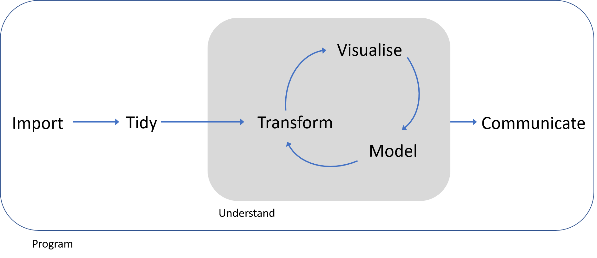

```{r, echo=FALSE, purl=FALSE}
knitr::opts_chunk$set(results='hide', fig.path='img/r-lesson-')
library(tidyverse)
```

------------

> ### Learning Objectives
>
> By the end of this lesson the learner will:
>
> * Have been introduced to ggplot2 for visualisation
> * Performed some more object assignments and functions calls.

--------------

<div style="text-align: center; margin-top: 30px; margin-bottom: 30px;">

</div>

# Data visualisation

Let's begin with visualisation of some data using the `ggplot2` pacakage. 

We're starting here as we gather data to ask and answer questions, and visualising data often provides the answers.

We're using ggplot2 as this implements the *grammer of graphics*, for describing
and building graphs. This is far from the only way to create graphs, but in this
course we'll be working within the *tidyverse*, a set of packages that implement
a coherent set of tools for data science in R. ggplot2 is a package that is part
of the tidyverse package.

We should have the tidyverse installaed and loaded already, which means ggplot2
is loaded and ready to go.

## Using graphs to explore data

### Do cars with big engines use more fuel than cars with small engines?

Included in ggplot2 is a data frame called `mpg` containing variables in columns
and observations in rows collected by the US Environmental Protection Agency for
38 models of cars.

Type `mpg` in the console window to take a look at this R object:

```{r,purl=FALSE,results='show'}
mpg
```

Try `?mpg` to learn more about the data.

1. Engine size in litres is in the `displ` column.
2. Fuel efficiency on the highway in miles per gallon is given in the `hwy` column.

To plot engine size (x-axis) against fuel efficiency (y-axis) we do the 
following:

```{r,purl=FALSE}
ggplot(data = mpg) + geom_point(mapping = aes(x=displ, y=hwy))
```


This plot shows a negative relationship between engine size and fuel efficiency.

What we did here was call the `ggplot()` function to create an empty graph, 
where the first arguement is the data (here `mpg`). The we used a `geom_point()` function to add a layer of points mapping the aesthetics for the x and y axes.

Mapping is always paired to aesthetics `aes()`. An asthetic is a visual property
of the objects in your plot, such a point size, shape or point colour.

> ### Challenge
>
> Is the trend the same for fuel efficiency in cities? 
>
> * Which variable represents city miles per gallon?
> * Can you produce a plot of engine size (x-axis) against city fuel 
efficiency (y-axis) ?
> * Is the trend positive or negative between engine size and city fuel 
efficiency ?

```{r, echo=FALSE, purl=TRUE}

# Is the trend the same for fuel efficiency in cities? 
# * Which variable represents city miles per gallon?
# * Can you produce a plot of engine size (x-axis) against city fuel 
# efficiency (y-axis) ?
# * Is the trend positive or negative between engine size and city fuel 
# efficiency ?

```

<!---
```{r, echo=FALSE, purl=FALSE}
## Answers
ggplot(data = mpg) + geom_point(mapping = aes(x=displ, y=hwy))
```
--->

Here we just used the values of x and y as points, but we could add a colour 
or shape aesthetic too.

But why? 

Suppose we also were trying to understand the relationship between the type of 
car, the engine size and fuel efficency. To contain all this information in 
a single plot we need to have a third aesthetic, a third property to decribe 
the car type, contained in the `class` column.

```{r,purl=FALSE}
ggplot(data = mpg) + geom_point(mapping = aes(x=displ, y=hwy, colour=class))
```

As we might expect, bigger cars such as SUVs tend to have bigger engines and 
are also less fuel efficient, but some smaller cars such as 2seaters also have
big engines and greater fuel efficency. Hence we have a more nuanced view with
this additional aesthetic.

Check out the ggplot2 documentation for all the aesthetic possibilities (and 
google for examples): http://ggplot2.tidyverse.org/reference/

So now we have re-useuable code snippet for generating plots in R:

```{r, purl=FALSE,eval=FALSE}
ggplot(data = <DATA>) + 
  <GEOM_FUNCTION>(mapping = aes(<MAPPINGS>))
```

Concretely, in our first example `<DATA>` was `mpg`, the `<GEOM_FUNCTION>` 
was `geom_point()` and the arguments we supplies to map our aesthetics 
`<MAPPINGS>` were `x=displ, y=hwy`.

### What is the availability of different types of diamond?

Plotting in R can do more than just display raw data, it can transform it at 
the same time. 

Also, we only looked at one type of geometric object, `geom_point`,
last time. Geoms are the type of data display ggplot2 creates e.g. points, 
boxplots, bar charts. Here we'll see some of the other geom types.

Let's look at another built in data frame called `diamonds`.

```{r,purl=FALSE,results='show'}
diamonds
```

This data set has records of about 54,000 diamonds, including price (dollars), 
quality of the cut (cut) and weight (carat).

Let's create a barplot of diamond cut quality using our code snippet:

```{r,purl=FALSE}
ggplot(data = diamonds) + 
  geom_bar(mapping = aes(x=cut))
```

What's happened here? Rather than plotting the raw data, ggplot has transformed
the data by counting the the number of diamonds in the row of data frame 
corresponding with each quality.

This statistical transformation of counting the rows is a default of `geom_bar()`,
by reading the help we can find out more `?geom_bar`, and how to change it.

We see that ideal cut quality diamonds are most abundant.

The depth measurement describes the relationship of the height to its width as
a precentage. Plotting this as a boxplot automatically calculates the the range
of depths, and associated statistics for each quality type.

```{r,purl=FALSE}
ggplot(data = diamonds) + 
  geom_boxplot(mapping = aes(x=cut,y=depth))
```

As before, we could apply another aesthetic, colour to also look at the same 
relationship, but also across the clarity types.

```{r,purl=FALSE}
ggplot(data = diamonds) + 
  geom_boxplot(mapping = aes(x=cut,y=depth, colour=clarity))
```

This is getting a bit harder to read, so finally we introduce the idea of facets.
Rather than mapping an additional aesthetic, we can used facets to split this 
into subplots using the following code:

```{r,purl=FALSE}
ggplot(data = diamonds) + 
  geom_boxplot(mapping = aes(x=cut,y=depth)) +
  facet_wrap(~ clarity)
```

But we're now struggling to fit the labels on the x-axis, so let's flip them
with `coord_flip()` to make things easier to read.

```{r,purl=FALSE}
ggplot(data = diamonds) + 
  geom_boxplot(mapping = aes(x=cut,y=depth)) +
  facet_wrap(~ clarity) + 
  coord_flip()
```

To use `facet_wrap()` with a single variable we call the function with a formula
such that the first arguement is `~` and then the variable `clarity`. This must
be a discrete variable.

So generally we can see that diamonds of the greateat abundance are also the most
uniform in terms of depth and clarity.

We'll return to plotting later and look at how to make them suitable for publication
by performing tasks such as relabelling axes or adding titles.

Hopefully you are beginning to see how a single line of code can do a lot.

# Workflow basics

Let's revisit the basics of working in R to conclude this part of the lesson.

## Assigning objects

We create objects using the assignment operator `<-`:

```{r, purl=FALSE,results='show'}
weight_kg <- 55
```

Read this as *"weight_kg gets value 55"* in your head.

Using `<-` can be annoying to type, so use RStudio’s keyboard shortcut: 
Alt + - (the minus sign) to make life easier. 

Object name style is a matter of choice, but must start with a letter and can 
only cointain letters, numbers, `_` and `.`. We reccomend using descriptive names
and using `_` between words.

So here we've used the name to indicate its value represents a weight in kilograms.

We can inspect an object by typing it's name:

```{r, purl=FALSE}
weight_kg
```

What's wrong here?

```{r, purl=FALSE,eval=FALSE}
weight_KG
```
`Error: object 'weight_KG' not found`

This error illustrates that typos matter, everything must be precise and `weight_KG`
is not the same as `weight_kg`. `weight_KG` doesn't exist, hence the error.

### Calling functions

Functions in R are objects followed by parathenses, such as `library()`. 
Functions have the form:

`function_name(arg1 = val, arg2 = val2, ...)`

Let's use `seq()` to create a **seq**uence of numbers, and at the same time practice tab completion.

Start typing `se` in the console and you should see a list of functions appear,
add `q` to shorten the list, then use the up and down arrow to hilight the function
of interest `seq()` and hit Tab to select.

RStudio puts the cursor between the parathenses to prompt us to enter some 
arguements. Here we'll use 1 as the start and 10 as the end:

```{r, purl=FALSE,results='show'}
seq(1,10)
```

If we left off a parantheses to close the function, then when we hit enter 
we'll see a `+` indicating RStudio is expecting further code. We either add the 
missing part or press Escape to cancel the code.

Let's call a function and make an assignment at the same time:

```{r, purl=FALSE}
my_sequence <- seq(1,10)
```

This time nothing was returned to the console, but we now have an object called
`my_sequence` in our environment.

Can you remember how to inspect it?

## Using scripts

Using the console is useful, but as we build up a workflow, that is to say,
wrting code to:

+ load packages 
+ load data
+ explore the data 
+ and output some results

Then it's much more useful to contain this in a script: a document of our code.

Why? When we write and save our code in scripts, we can re-use it, sharing or editing., but **most importantly a script is a record**.

Cmd/Ctrl + Shift + N will open a new script file up and you should see something
like below with the script editor pane open:


### Running code and diagnosing problems

How to run lines or sections of code.
How to diagnose errors.

# R objects

R has five basic (atomic) classes of objects:

+ character
+ numeric (real numbers)
+ integers (whole numbers)
+ complex numbers
+ logical (True/False)

Collections of objects are vectors, and vectors will only store one class of 
basic object. If you mix classes e.g. characters and integers, R will coerce
them to be all the same class e.g. your integers may become characters.

### Inspecting and extracting elements from vectors and data.frames


