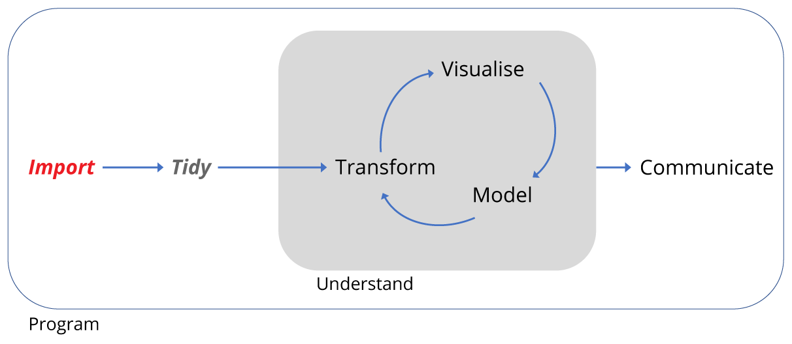
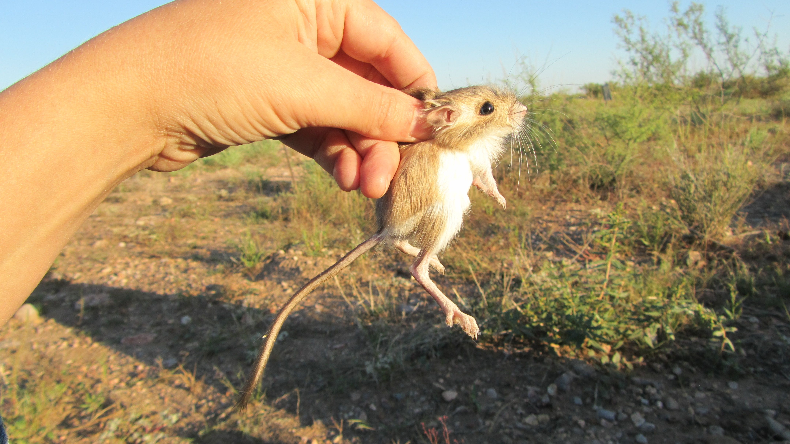
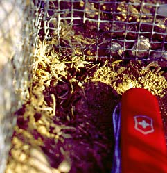
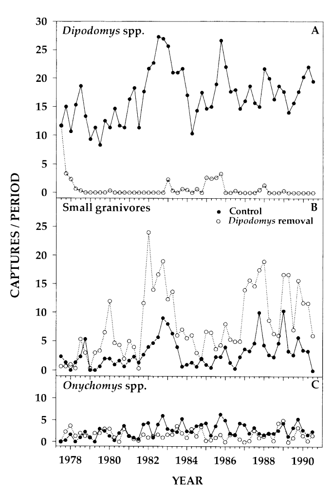
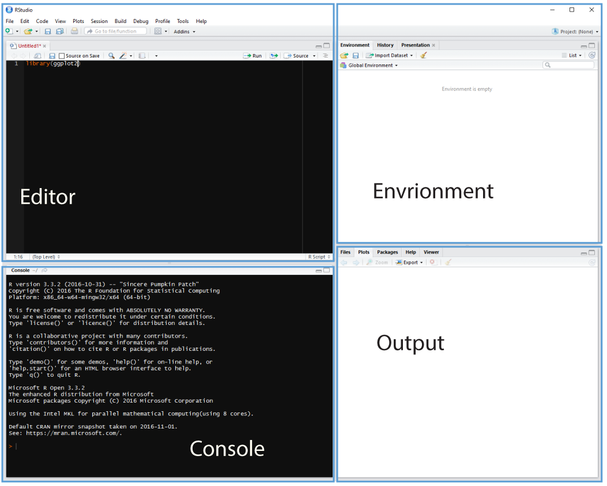
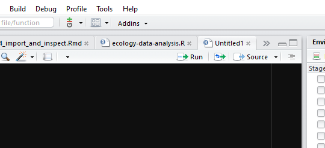

```{r, echo=FALSE, purl=FALSE, message = FALSE}
source("setup.R")
```

------------

> ### Learning Objectives
>
> * How to create a script
> * Learn how to download and import data into a data frame using `download.file()` 
and the readr package
> * Learn how examine imported data and what tidy data is.
> * Describe what a data frame is.
> * Know how to inspect imported data.
>

------------

<div style="text-align: center; margin-top: 30px; margin-bottom: 30px;">

</div>

In the remaining lessons we are going to recapitulate some of the analysis found 
in the 1994 paper by Heske et. al., **Long-Term Experimental Study of a 
Chihuahuan Desert Rodent Community: 13 Years of Competition**, DOI: 10.2307/1939547.

Specifically we are going to look at the effect on the populations of small
seed eating rodents as a result of the exclusion of larger competitor kangaroo
rats over a period from 1977 to 1991.

Below is an image of one of the species of kangaroo rats excluded during the
study.



The following image indicates how the exclusion works, where a for number of
fenced plots the kangaroo rats were either able to enter by a hole or kept out.



The plots are 50 metres by 50 metres, and a survey of the species within each
plot has been ongoing once a month for many years.

Here will practice importing data, transforming
data, and plotting data, and finally turning this script into a report.

A conclusion of the paper is that there is evidence that kangaroo rats 
compete directly with four other rodent species, as evidenced by an increase in
the populations of these four species when kangaroo Rats are excluded.
This can be seen in Figure 1 in the paper, and we will try to reproduce the 
analysis to generate a similar figure and confirm these observations.

This figure shows the number of captures of threes species of kangaroo Rats
and five species of smaller granivore rodents over a period from 1977 to 1990.
Panel A shows the populations when the eight species were left to compete for 
resources and Panel B shows the effect of excluding the kangaroo Rats.



# Importing, inspecting and tidy data

First we will learn how to download, import and inspect the rodent 
survey data, and the meaning of tidy data.

 + Importing means getting data into our R environment by turning into into a
 R object that we can then manipulate. The raw data file remains unchanged.
 + Inspecting means looking at the dataset to understand what it contains.
 + Tidying refers to getting data into a consistent format that makes it easy to
 use in later steps.
 
 A note here is that we are focusing on rectangular data, the sort that comes
 in rows and columns such as in a spreadsheet. Lots of our data types exist,
 such as images, which are beyond the scope of this lesson, but can also be
 handled by R.
 
 A further note on tidy data. Tidy data can also come in various forms, but for
 rectangular data we will use the convention where every variable forms a column,
 every row forms an observation and every type of observational unit is stored
 in a separate table (we only have one table here, so the last point is moot.)

## Using scripts

Using the console is useful, but as we build up a workflow, that is to say,
wring code to:

+ load packages 
+ load data
+ explore the data 
+ and output some results

Then it's much more useful to contain this in a script: a document of our code.

Why? When we write and save our code in scripts, we can re-use it, sharing or editing., but **most importantly a script is a record**.

Cmd/Ctrl + Shift + N will open a new script file up and you should see something
like below with the script editor pane open:



### Running code

We can run a highlighted portion of code in your script if you click the Run
button at the top of the scripts pane. 



You can run the entire script by clicking the Source button.

Or we can run chunks of code if we split our script into sections, see below.

## Creating a R script

We first need to create a script that will form the basis of our analysis.

Go to the file menu and select New Files > R script. This should open the script
editor pane.

Now let's save the script, by going to File > Save and we should find ourselves
prompted to save the script in our Project Directory.

### Filenames

File names should be meaningful and end in `.R`. A good name would be 
`ecology-data-analysis.R` and a bad name would be `file.R`. Let's use the good
example for our file name.

### Comments

In R, any line beginning `#` is  a comment line. Comments all your code to 
explain (to yourself) what is happening. The script can be turned into a report
so the more comments you add the more time you save later on.

Starting on line 1, let's put comment lines for the script title, our name and
date.

```{r purl=FALSE}
# Ecology data analysis
# My name and today's date
```

### Line length

It's a good idea to keep lines to 80 characters to help make the code easy to
read. You can display a margin from the Tools menu to show where 80 characters 
ends.

### Code sections

We don't always want to run the entire script, so it's useful to split our 
script into sections, or code regions. Any comment line which includes 
at least four trailing dashes (-), equal signs (=), or hash/pound signs (#) 
to automatically creates a code section:

```{r,purl=FALSE}
# This is a comment

# The dashes create a code region ----

# Let's create a character object called myName here:
myName <- "Alistair"

# Equals signs also create another code region =====

# And hash/pound symbols also create code regions ####

```

We can run each region separately, or the entire thing.

### Setting up our R environment

We only need the `tidyverse` library, which  contains all the packages we need 
for our analysis, so we add this to our script as before:

```{r,purl=FALSE,message=FALSE}
# Load the tidyverse set of packages -------------------------------------------
library(tidyverse)

```

# Downloading and importing data

## Downloading the rodent survey data from the web

Often you'll be working with data you've generated and stored locally, but you 
may need to download data on occasion.

This gives us the chance to practice creating objects and try out using function 
with a condition. 

+ First we create the `url` object containing the web address of the 
data we need.
+ Second we a `path` object containing the address of where we want to download
the data to and what to call the file. In this case it is the `data` folder we
created and we will call it `portal_data_joined.csv`.
+ Then we use an `if` statement combined with a condition with the logical (TRUE/FALSE)
 `file.exists()` function to decide whether or not to download 
the data. The NOT condition `!` means if `portal_data_joined.csv` doesn't 
exist already, download it.


```{r purl=FALSE}
# Download the and import the data ---------------------------------------------

# First we assign the web address as a string to a R object called 'url'.
# Then we assign another string object called 'path' that states where we 
# want to import the data to.
# Next we use and 'if not' statement to check if the data has alredy been 
# downloaded. The '!' in front of 'file.exists' is a logical operator for 'not'.
# If there is no file called 'portal_data_joined.csv' in the 'data' folder,
# download the file.

# URL for portal joined survey data
url <- "https://ndownloader.figshare.com/files/2292169"
# Path and filename for downloading
path <- "data/portal_data_joined.csv"

# Check if the file exists, and if not download it to the data folder
if (!file.exists(path)) { download.file(url,path) }
```

## Importing data using `readr`

Now we have downloaded it (check your data folder) we need to import it.
As we have the `tidyverse` packages we can use the `readr` package it contains,
which has many functions for reading files, including `read_csv()`

```{r,purl=FALSE}
# Next we import the data using the 'readr' package and 'read_csv' function
# We'll assign the data to a R object called 'surveys'. 
# read_csv creates a 'tibble' a modified form of data frame with enhanced
# printing and checking capabilites.
surveys <- read_csv('data/portal_data_joined.csv')
```

## A note on Excel files

The best way to move data from Excel to R is to export the spreadsheet from
Excel as either a `.csv` or `.txt` file. These formats can be used with most
data analysis software.

However, `readxl` is a `tidyverse` package that can be used for importing excel files to R.

Usage instructions can be found here: http://readxl.tidyverse.org/ 

# Inspecting the dataset

Having imported the data, we should look at the structure of the data. We'll
use the `glimpse` function that tries to provide the most compact and informative
view.

```{r,purl=FALSE,results='show'}
# Inspect the data with 'glimpse' ----------------------------------------------

glimpse(surveys)

# This data is tidy already: each variable is a column, each observation is a
# row and each cell contains a single variable.

# Q: Is there missing data?

# Q: How long a period does the dataset cover?

# Q: How many different taxa are there? 
# (taxa are organism types e.g. plants or birds)

# Q: How many species are there?
# (individual species belong in their taxa)

# For this analysis we need to subset the plots that were used in the paper,
# the species and taxa that were analysed, the time period of the experiment, and
# remove any missing data.
```

> ### Challenge
> Is there missing data? (R uses `NA` to represent missing values.)
>
> How long a period does the dataset cover?
>
> HINT: columns in a data.frame can be accessed using `$` sign in the form `data_frame$column_name`
> HINT: try the `range()` function on the `year` column.
>
> How many different taxa are there? (taxa are organism types e.g. plants or birds)
>
> HINT: try the `distinct()` function to find the unique values for taxa. This 
function is takes arguments of the form `distinct(data_frame,column_name)`.
>
> How many species are there? (Use distinct again, but this time add `%>% count()` to the end of the command. This pipes the output of distinct to the
`count()` function)
>