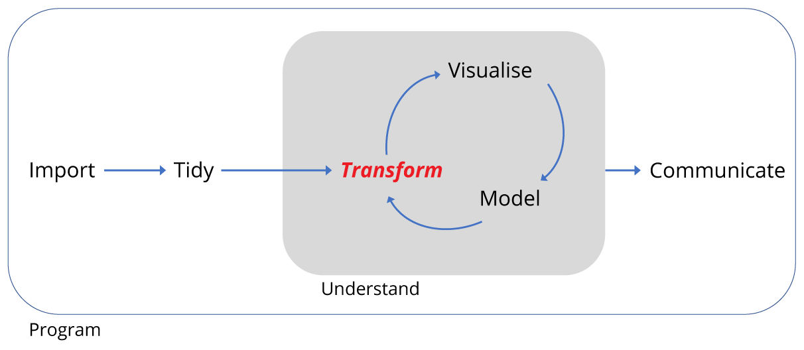
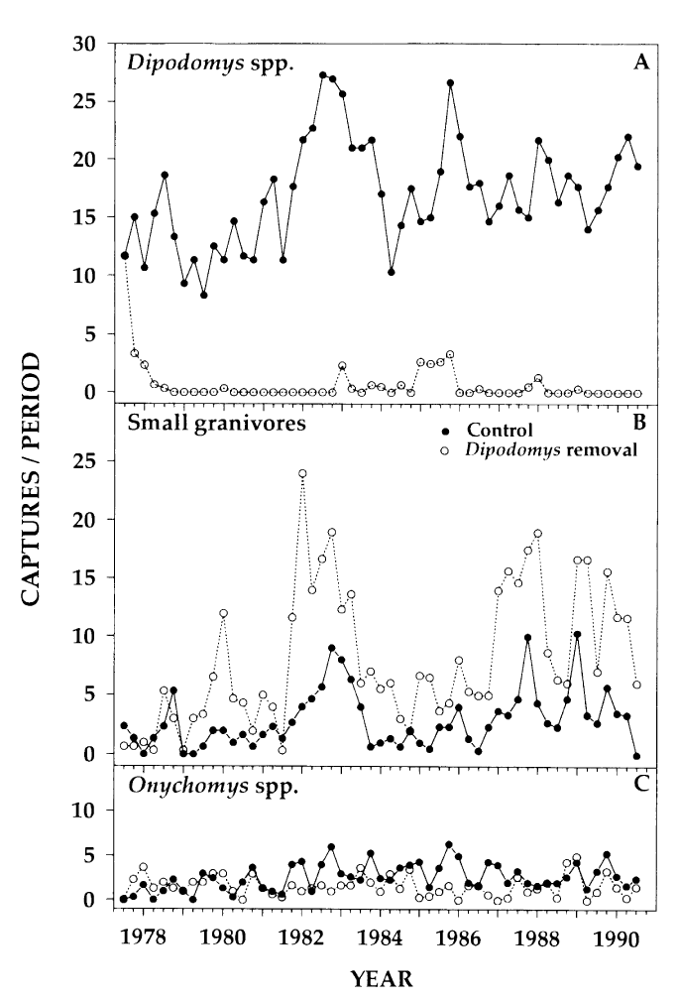
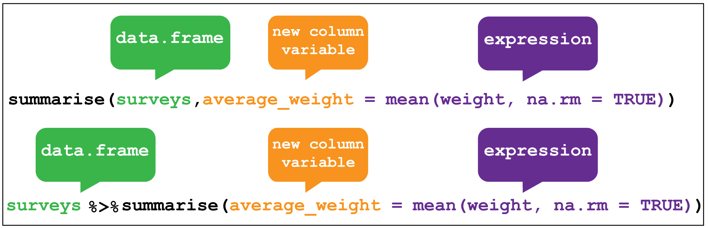

```{r, echo=FALSE, purl=FALSE, message = FALSE}
source("setup.R")
knitr::opts_chunk$set(results='hide', fig.path='img/r-lesson-')
# Load the tidyverse set of packages -------------------------------------------
library(tidyverse)
library(forcats)
surveys <- read_csv('data/portal_data_joined.csv')
```

------------

> ### Learning Objectives
>
> By the end of this lesson the learner will have been introduced the key verbs 
of the `dplyr` package needed to transform tidy data into new forms. They will be
able to:
>
> * Filter observations with `filter()`
> * Arrange observations according to variable(s) with `arrange()`.
> * Select variables with `select()`
> * Create new variables from existing variables with `mutate()`
> * Create grouped summaries with `group_by` and `summarise()`
>
> The learner will also be introduced to piping operations and working with dates 
along the way.

------------


<div style="text-align: center; margin-top: 30px; margin-bottom: 30px;">

</div>

## Motivation

Data rarely comes in the form we need it in, hence we need to transform it.

In this lesson we'll transform data using another tidyverse package `dplyr` to:

+ change the focus. For example, filtering data for (observations) rows or 
selecting (variables) columns of interest. 
+ create new variables that are functions of existing variables. For example,
transforming separate day, month and year variables into a single data variable.
+ calculate summarised data such as observations per three months.

Often these operations can be combined, known as piping, which is very
powerful and convenient.

Our goal is to reproduce the analysis of the 1994 Heske et. al. paper is that 
there is evidence that kangaroo rats compete directly with four other rodent 
species, generating a similar figure to the one below, to confirm their observations.

Concretely, we are going to look at the effect of kangaroo rat exclusion on the 
populations of smaller granivores in two 0.25 hectare plots versus two plots
where kangaroo rats were allowed access.

Panels A and B shows the number of captures of threes species of kangaroo rats
and five species of smaller granivore rodents over a period from 1977 to 1990.
Panel A shows the populations when the eight species were left to compete for 
resources and Panel B shows the effect of excluding the kangaroo Rats.

For simplicity we're going to ignore Panel C, which examines grasshopper rats,
and only 



## Filtering observations

The first verb to consider is `filter` which enables us to subset observations
based on their value.

Consider the surveys data and sub-setting observations that only occurred from
1985 onwards. It's fairly natural to say *"filter the survey where the year
variable is equal or greater than 1985"*. And indeed this is how we use `filter`
as a verb. 

In the code below, we give the filter function two arguments. The first is the
data frame, the second is the variable and condition on which we wish to filter.

(Note that we aren't assigning the output to an object here, so we can see it.)


<br>
```{r,purl=FALSE,results='show'}
# Filter observations that only occurred from 1985 onwards
 filter(surveys, year >= 1985)

```

We could even do this for a specific date and species (assuming we know there was 
an observation), using values for day, month, year and species.


```{r,purl=FALSE,results='show'}
# Filter observations that only occurred on the 9th of March 1986
 filter(surveys, month == 3, day == 9, year == 1986, species_id == "NL")
```

An alternative way to use `filter` is to "pipe" the function using `%>%` which you can think of as using the word *"then"*. We take our data set *then* filter it. 

This makes more sense when combining several operations, but even with one
operation it means we only have to provide the values argument to the filter, 
like so:


```{r,purl=FALSE,results='show'}
# Pipe the filter for observations that only occurred on the 9th of March 1986
surveys %>% filter(month == 3, day == 9, year == 1986, species_id == "NL")
```

Armed with this information, let's filter the data for the period covered in the 
paper figure, from the start of the surveys in 1977 until the end of 1990.

> ### Challenge
> Filter the surveys from 1977 until 1990 and assign the output to `surveys_filtered`
> 
> Using the pipe `%>%` is optional, but recommended.
>
> Ctl+Shift+M is a shortcut to create a pipe.
>

```{r,purl=FALSE,echo=FALSE}
# Answer to challenge
surveys_filtered <- surveys %>% filter(year <= 1990)
```

> <span style="background:yellow">See 
>[SQL basic queries lesson](http://www.datacarpentry.org/sql-ecology-lesson/01-sql-basic-queries/)
> to compare using `dplyr` in R with filtering and selecting in SQL.</span>
>

To reproduce the analysis in the paper we need to know which which four plots 
the different treatments were carried out on.

The codes for the twenty four plots
are found [here](https://github.com/weecology/PortalData/blob/master/SiteandMethods/Portal_plot_treatments.csv).

To save time, here is a summary of the ones we need, which you can paste into 
your script:

```{r}
# Control Plots: 2,8,12,22
# Treatment Plots: 3,15,19,21

# Create a vector for the experimental plots
exp_plots <- c(8,11,12,14,3,15,19,21)

# Keep only the rows corresponding with the experimental plot_id's
surveys_filtered <- surveys_filtered %>% filter(plot_id %in% exp_plots)
```

## Arranging observations

Although we don't need to do this here, it is worth mentioning the other key
verb for working with the observations in the rows is `arrange()` which enables
you to arrange the observations in a data frame according to one or more variables.

As with `filter()` we supply the variable or variables of interest as the arguments
to `arrange()`.

For example we could arrange the observations according to the `record_id` 
variable:


<br>

```{r,purl=FALSE,results='show'}
# Look at the original order of the observations
surveys
# Arrange the surveys according to record_id. Note the default is ascending order
surveys %>% arrange(record_id)
```

Check out the `?arrange` for more examples and information about using this function.

## Selecting variables

Selecting the variables contained in the columns can be done in various ways. 
For example, by the column number, the variable name or by range. Check the help function `?select` for more options.


<br>
```{r,purl=FALSE,results='show'}
# Select the year and plot type columns
surveys %>% select(year,plot_type)
```

As we saw earlier, we have thirteen variables in the surveys data, but we don't 
need all of them. Specifically we don't need the sex, the hind-foot length or the
weight of the animals. We're just interested in the population changes over time.

Rather than selecting the columns we want, an alternative is to drop the ones we
don't using a minus sign in front of the variable name, like so:

```{r,purl=FALSE,results='show'}
# Select everything except sex, hindfoot and weight
surveys_selected <- surveys_filtered %>% select(-sex,-hindfoot_length,-weight)

# Check the output
glimpse(surveys_selected)
```

## Creating new variables

Often we need to create new variables that are functions of existing columns.
For example, in the survey data there are forty species, of which we are only
interested in eight. Moreover, we are interested in comparing the three
Kangaroo Rat species with the five smaller granivores, so it would be useful
to have a variable the categorised the rodents as either "Kangaroo Rat" or
"Carnivore".

We could do this using `mutate` to create a `rodent_type` variable that is
a function of the `species_id` column.


<br>

This is a little tricky, but the steps are as follows:

1. We create a lookup table in the form of a named vector which we'll call `lut`. 
The names of each  element in `lut` correspond with one of the eight `species_id` 
we are interested in.. The values of each named element are either `Kangaroo Rat` 
or `Granivore`.

2. Next we can use the lookup table to filter `surveys_selected` 
for observations where the `species_id` match the names of the lookup table elements
by passing `lut` as an argument to the function `names()`.

3. Now when we subset the lookup table with a character string, here 
`species_id` from the `surveys_selected`, it will return the values in the lookup
table that correspond with the names in the `species_id` character string. For 
example, subsetting `"DM"` in the lookup table will return the value `Kangaroo Rat`.

4. Using `mutate` we can create a new variable called `rodent_type` that contains
the values return from subsetting the lookup table using `species_id` from the `surveys_selected`.

The codes associated with the forty species in the survey data are found 
[here](https://github.com/weecology/PortalData/blob/master/Rodents/Portal_rodent_species.csv), but to save time the relevant codes are shown below. These codes are
used to createthe lookup table `lut` as shown.


```{r,purl=FALSE,results='show'}
# Kangeroo Rats:
# DM 	Dipodomys merriami 	        Rodent  Merriam's kangaroo rat
# DO 	Dipodomys ordii             Rodent  Ord's kangaroo rat
# DS 	Dipodomys spectabilis 	    Rodent 	Banner-tailed kangaroo rat

# Granivores:
# PP 	Chaetodipus penicillatus  	Rodent 	Desert pocket mouse
# PF 	Perognathus flavus 	        Rodent 	Silky pocket mouse
# PE 	Peromyscus eremicus         Rodent  Cactus mouse
# PM 	Peromyscus maniculatus 	    Rodent 	Deer Mouse
# RM 	Reithrodontomys megalotis 	Rodent 	Western harvest mouse

# Create a named vector as a lookup table, where the names of each vector
# element correspond with the species_id, and the values of each vector 
# element are either Kangaroo Rat or Granivore
lut <- c("DM" = "Kangaroo Rat",
         "DO" = "Kangaroo Rat",
         "DS" = "Kangaroo Rat",
         "PP" = "Granivore",
         "PF" = "Granivore",
         "PE" = "Granivore",
         "PM" = "Granivore",
         "RM" = "Granivore")

# Mutate surveys_selected
surveys_mutate_rodent <- surveys_selected %>%
  # Filter for observations only for the eight rodents species.
  # The condition is where species_id matches the names of the lookup table
  # vector elements
  filter(species_id %in% names(lut)) %>% 
  # Create a new variable called rodent_type as a function of species_id
  # by using the look-up table to return values of Kangaroo Rat and Granivore
  # that match the species_id code.
  mutate(rodent_type = lut[species_id])

# Check the output using a summary pipe, we should have 8 species of 2 types
surveys_mutate_rodent %>% group_by(species_id,rodent_type) %>% summarise()
```

We'll come back to `group_by()` and `summarise()` very shortly.

Secondly it would be much more convenient to have a single `date` variable, and 
we can make one as a function of the `day`,`month` and `year` variables using 
another tidyverse package called `lubridate`. 

Don't worry to much about the details of the code, it's the concept that matters.

We call the `lubridate` function `dmy()` explicitly by using the package name 
followed by two colons. This in turn uses the `sprintf()` function to parse the
column variables. 

```{r,purl=FALSE,results='show'}
# Mutate surveys_selected to create a Date column from the day,month and year
# variables
surveys_mutate_date <- surveys_mutate_rodent %>%
  # Convert day, month and year using lubridate
  mutate(date = lubridate::dmy(sprintf('%02d%02d%04d', day, month, year)))

# Check the output
glimpse(surveys_mutate_date)
```

> ### Challenge
> Create a data frame called `surveys_kg` with a new variable that converts the the original data frame `surveys` `weight` variable to kilograms, call the 
new variable `weight_kg`.
>
> `weight` is in grams, so you need to divide by 1000 to convert to kg.
> Missing values can be removed using the `filter()` and `is.na()` functions like
so: `filter(!is.na(weight))`. We need `!` to make it "is not a NA".

```{r,purl=FALSE,echo=FALSE,eval=FALSE}
surveys %>% mutate(weight_kg = weight / 1000) %>% 
  filter(!is.na(weight)) %>% 
  glimpse()
```

> <span style="background:yellow">See 
>[SQL basic queries lesson](http://www.datacarpentry.org/sql-ecology-lesson/01-sql-basic-queries/)
> to compare using `dplyr` in R with performing calculations in SQL.</span>
>

## Putting it all together

Rather than doing each of these steps individually, we could pipe these four operations together to create our `surveys_subset` data frame.

Note here, we've added another variable called `quarter` which calculates the 
three monthly date period. This is what they plotted in the paper, which is
then helpful for comparing our plot to the published one.

```{r,purl=FALSE,results='show'}
surveys_subset <- surveys %>% 
  # Filter observations from 1977 to 1990, for the 3 K-rats and 5 granivores, 
  # and for the 4 experimental plots
  filter(year <= 1990,                    
         species_id %in% names(lut),         
         plot_id %in% exp_plots) %>%      
  # Use lookup table to create variable to indicate whether species is K-rat 
  # or Granivore
  mutate(rodent_type = lut[species_id],
         # Make combined date variable
         date = lubridate::dmy(sprintf('%02d%02d%04d', 
                                       day, month, year)),
  # Add the quartley period
  quarter = lubridate::quarter(date,with_year = TRUE)) %>% 
  # Drop unwanted variables
  select(-sex,-hindfoot_length,-weight)
```


## Grouped summaries

The last verb we'll consider is `summarise()`, which collapses a data frame
into a single row. For example, we could use it to find the average weight
of all the animals surveyed in the original data frame using `mean()`. (Here the
`na.rm = TRUE` argument is given to remove missing values from the data, 
otherwise R would return `NA` when trying to average.)


<br>

```{r,purl=FALSE,results='show'}
surveys %>% summarise(average_weight = mean(weight,na.rm=TRUE))
```

`summarise()` is most useful when paired with `group_by()`
which defines the variables upon which we operate upon. 

In the previous section we used this pairing to check when the species were 
correctly assigned their rodent type. We first grouped `species_id` and 
`rodent_type` together and then used `summarise()` without any arguments to
show a summary of these two variables only.


<br>

```{r,purl=FALSE,results='show'}

# Check the output using a summary pipe, we should have 8 species of 2 types
surveys_mutate_rodent %>% group_by(species_id,rodent_type) %>% 
  summarise()
```

Let's re-cap what we've done so far, and remind ourselves of the question we're
trying to answer:

*Q: Is there evidence that kangaroo rats compete directly with four other 
granivore rodent species?*

The evidence we are examining is the monthly populations of 8 species surveyed
in four plots over a period of about 13 years. The initial dataset contains data
about 40 species in 20 plots measuring 13 variables over 25 years.

At this point we have:

+ Filtered the observations for the time period of interest, and for the species
and plots of interest.
+ We've created new variables for the rodent type, the date, and the year quarter
+ We've selected only the variables we need to answer the question.

This reduces the dataset from around 35,000 observations of 13 variables to 
around 5,000 observations of 13 variables. We dropped three of the original
variables and create three new variables.

We could start plotting the data, but it would be useful to summarise this 
a bit more. Concretely, we'd like to summarise the kangaroo rat and granivore
populations on a monthly or quarterly basis. Or by genus.

This is where grouped summaries are very useful. 

Grouping simply means grouping the variables of interest that we want to operate on, here they are the `rodent_type` (kangaroo rat and granivore), 
the `quarter` (the time period) and the `plot_type` (kangaroo rat exclusion or
control). The summary we would like is the number of captures for each group e.g.
number of captures of kangaroo rats for the first quarter of 1980 in the control 
plots. As each row in the table corresponds with a capture, we just need to count
the number of rows in each group. We can do this using the count function `n()`
in conjunction with summarise. This creates a new variable, a column containing the number of rows counted per group, which we'll call captures.
`captures`.

Here we have the additional issue that the grouping by quarter groups three
months worth of captures, so to get the quarterly average number of captures we
divide the number of rows counted by three.

```{r,purl=FALSE,results='show'}
# Summarise the data by rodent type, quarterly survey and plot type
by_quarter <- surveys_subset %>% 
  group_by(rodent_type,quarter,plot_type) %>% 
  summarise(captures = n()/3) 

glimpse(by_quarter)
```

**We have now transformed the dataset from a 35,000 observations of 13 variables
table to the 185 observations of 4 variables table that we need for re-creating 
the plot shown in the paper.**

Compare the output of `glimpse(surveys)` to `glimpse(by_quarter)`.

But, this is not the only way to look at the data, so we'll keep the unsummarised
subset too. We could export the subset for sharing, but generally it's better
to share the raw data (if it's not too large) and a script containing the 
code that will reproduce your transformations. Raw data is the form you received 
it in, it doesn't necessarily mean that the data hasn't been manipulated 
upstream.

We'll finish this lesson with a challenge that uses the transformed data and 
rolls it up into 4 observations of 3 variables data frame by sucessive use 
of grouping and summarising.

> ### Challenge
> Use the `group_by()` and `summarise()` functions successively to examine
> whether the exclosure of kangaroo rats is successful or not.
>
> First calculate the monthly captures per rodent type and plot type, then the
> yearly captures, and finally the total captures:
>
> 1. Create a summary data frame of `surveys_subset` called `per_month` grouping by 
> `rodent_type` ,`plot_type`, `year` and `month`. Pipe the output to `summarise()`
> to create a new variable that calculates the monthly captures
> for each genus by replacing `_` in `summarise(montly = _)` with the 
> row counting function `n()`.
> 2. Create a `per_year` data frame, using `per_month` with `summarise()` to create
> a `yearly` variable that sums the monthly captures. Provide `per_month` and
> `sum(monthly)` as the arguments to `summarise()`.
> 3. Finally create a `total` data frame, summing the total caputures per rodent
> type and plot type by providing `per_year` and and `sum(yearly)` as the 
> arguments to `summarise()`.
>
> Inspect `total` to see if the number of captures indicates whether the 
> exlosure works to keep kangaroo rats out.
>

```{r,purl=FALSE,echo=FALSE,eval=FALSE}
# Challenge, summarise by month and by genus instead
per_month <- surveys_subset %>% 
  group_by(rodent_type,plot_type,year,month) %>% 
  summarise(monthly = n()) 

per_month

per_year <- summarise(per_month, yearly = sum(monthly))

per_year

total <- summarise(per_year,total_captures = sum(yearly))

total
```

> <span style="background:yellow">See 
>[SQL aggregation lesson](http://www.datacarpentry.org/sql-ecology-lesson/02-sql-aggregation/)
> to compare using `dplyr` in R with creating grouped summaries in SQL.</span>
>