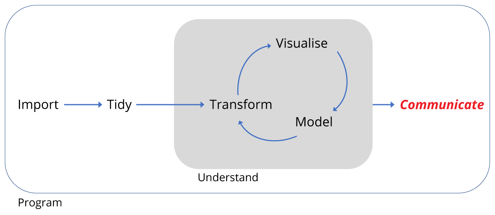

```{r, echo=FALSE, purl=TRUE}
knitr::opts_chunk$set(results='hide', fig.path='img/r-lesson-')
```

------------

> ### Learning Objectives
>
> In this lesson the learner will:
>
> * Turn the R script they have created into a shareable report.
> * Export data for sharing in CSV format.
> * Export figures in pdf or png format.

--------------

<div style="text-align: center; margin-top: 30px; margin-bottom: 30px;">

</div>


## Motivation

Recall that we began with a data set of around 35,000 observations covering
40 species spread over 24 plots.

We have imported and transformed the data to both subset the observations and
variables of interest, and to summarise the data. We then plotted the summarised
data. We did this all in a R script. 

As mentioned at the start, it's good to think of the script as the reality of 
the analysis. It contains all the code necessary to reproduce the analysis, and
unless we change the code or the data we import, it should reproduce it exactly
every time we run the code. So it's a really important document.

However, not everyone can use R, and we might wish to communicate the analysis
outside of the R environment. Therefore we need to be able to export data too.

Here we'll briefly cover three aspects of exporting:

+ exporting data in spreadsheet form
+ exporting figures for use in documents or presentations
+ turning our script into a report

This last point is particularly useful in situations such as writing a 
dissertation or manuscript where you might need to include the code you used in 
an analysis.

## Exporting data 

The simplest way to export data for excel is to output our data frame as 
comma separated variable (.csv). We can either do this using `write_csv` for
a general csv format, or in an excel specific csv format `write_excel_csv()`.

In my project directory I've created a folder called `data_output` to export
files to.

The write functions can take a number of arguments, but in the simplest form
we need to provide the name of the data frame we're exporting, `surveys_subset`
and a character string for the location and file name we want to save. Here
that's `"data_output/surveys_subset.csv"`. The forward slash indicates the
file is going in the `data_output` folder.

```{r,purl=FALSE,echo=TRUE,eval=FALSE}
# Write surveys in csv format
write_csv(surveys_subset,"data_output/surveys_subset.csv")
# Write out an excel formatted csv
write_excel_csv(surveys_subset,"data_output/surveys_subset_excel.csv")
```

Having run the code, can open the files up to have a look.

There's lots more information on data export here: [R Data Import/Export](https://cran.r-project.org/doc/manuals/r-release/R-data.html).

## Exporting figures

Another common task is to export figures for presentations or to put in a 
document. Two common formats are portable network graphics (.png), good
for PowerPoint, and portable document format (.pdf), good for high quality documents.

The best way to export figures in R is using code that opens a file in the format
you require, makes the plot, and then you close the file. **It's important to 
remember to close the file.**

First we're going to create our plot as an object instead of plotting directly
as we did before:

```{r,purl=FALSE,echo=TRUE,eval=FALSE}
# Create the plot as an object called pub_plot
pub_plot <- ggplot(data = by_quarter,
                   aes(x=quarter, y=captures, linetype = plot_type,
                             shape = plot_type)) +
  geom_line() +
  geom_point() +
  facet_wrap(~ rodent_type, nrow = 2) +
  scale_x_continuous(breaks = seq(1978,1990,2)) +
  labs(x ="YEAR",
       y ="CAPTURES / PERIOD",
       linetype = "",
       shape = "") +
  theme_linedraw() +
  theme(axis.text = element_text(size = 12, face = "bold"),
        axis.title = element_text(size = 12, face = "bold"),
        strip.text = element_text(size=12),
        panel.grid = element_blank(),
        aspect.ratio = 0.6, 
        legend.position = "top")
```

Now we have our figure as an object called `pub_plot` we can plot it to any 
format we wish, just by calling the object. 

Here are two bits of code for exporting the same figure as a png
and as a pdf.

```{r,purl=FALSE,echo=TRUE,eval=FALSE}
## Write out a png of the figure
# Open a png file and give it a name
png("fig_output/capture_of_rodents.png")
# Create the plot
pub_plot
# Close the file
dev.off()

# Write out a pdf of the figure
# Open a pdf file
pdf("fig_output/capture_of_rodents.pdf")
# Create the plot
pub_plot
# Close the file
dev.off()
```

Both these functions can take lots of other arguments, so check out `?png`
and `?pdf` for more details.

## Compiling scripts into reports

Finally, we can turn our code into a report. This is one reason why
good comments are important, as our comments become the text of the report. 
By writing the analysis code and the report at the same time can save us 
duplicating our efforts.

For a more sophisticate approach, check out the [R Markdown chapter](http://r4ds.had.co.nz/r-markdown.html) of R for Data Science. Here
we'll do a simplified approach.

At the top of our script, insert some comments lines in the following form:

```{r, purl=FALSE,echo=TRUE,eval=FALSE}
#' ---
#' title: "Name of report"
#' author: "Your name"
#' date: "Today's date"
#' ---
```

Note the `#'` form of the comment line, with an apostrophe, this tells R to 
interpret this code to create the report header when we compile the script.

In the rest of the script we can use `#'` to create comments we want to be converted to regular text when we compile the script. Putting nothing after the
`#'` creates a blank line.

We can also create headings, for example:

```{r, purl=FALSE,echo=TRUE,eval=FALSE}
#' This would be a line of regular text
#'
#'# A big heading
#'
#'## A smaller heading
#'
#'### An even smaller heading
```


This form: `#+`, can be used for controlling figure sizes:

```{r,purl=FALSE,echo=TRUE,eval=FALSE}
#+ fig.height=10
pub_plot
```


Take a moment to insert some of these kinds of comments into your script, our
example is below.

```{r,summary_script,purl=FALSE,echo=TRUE,eval=FALSE}
#' ---
#' title: "Competition in Desert Rodents"
#' author: A. Bailey 
#' date: 21st June 2017
#' ---

#' This script recapitulates some of the analysis found in the 1994 paper by 
#' Heske et. al., Long-Term Experimental Study of a Chihuahuan Desert Rodent 
#' Community: 13 Years of Competition, DOI: 10.2307/1939547.
#'
#' This paper examined the effect on the populations of small seed eating rodents
#' as a result of the exclusion of larger competitor kangeroo rats over a period 
#' from 1977 to 1991.
#'
#'### Load the tidyverse set of packages
library(tidyverse)
library(forcats)

#'### Read in the data
#' Assuming the data has been downloaded to the data folder:
surveys <- read_csv('../data/portal_data_joined.csv')

#' This data has 34,786 observations of 13 variables.
#' #'
#' We only need the observations for 8 species and 8 plots.
#'
# Kangeroo Rats:
# DM 	Dipodomys merriami 	        Rodent  Merriam's kangaroo rat
# DO 	Dipodomys ordii             Rodent  Ord's kangaroo rat
# DS 	Dipodomys spectabilis 	    Rodent 	Banner-tailed kangaroo rat

# Granivores:
# PP 	Chaetodipus penicillatus  	Rodent 	Desert pocket mouse
# PF 	Perognathus flavus 	        Rodent 	Silky pocket mouse
# PE 	Peromyscus eremicus         Rodent  Cactus mouse
# PM 	Peromyscus maniculatus 	    Rodent 	Deer Mouse
# RM 	Reithrodontomys megalotis 	Rodent 	Western harvest mouse

# Create a vector for the experimental plots, four controls, four kangeroo rat
# exclusion plots
exp_plots <- c(8,11,12,14,3,15,19,21)

# Create a character vector for rodents
# Create a named vector as a lookup table, where the names of each vector
# element correspond with the species_id, and the values of each vector 
# element are either Kangaroo Rat or Granivore
lut <- c("DM" = "Kangaroo Rat",
         "DO" = "Kangaroo Rat",
         "DS" = "Kangaroo Rat",
         "PP" = "Granivore",
         "PF" = "Granivore",
         "PE" = "Granivore",
         "PM" = "Granivore",
         "RM" = "Granivore")

surveys_subset <- surveys %>% 
  # Filter observations from 1977 to 1990, for the 3 K-rats and 5 granivores, 
  # and for the 4 experimental plots
  filter(year <= 1990,                    
         species_id %in% names(lut),         
         plot_id %in% exp_plots) %>%      
  # Use lookup table to create variable to indicate whether species is K-rat 
  # or Granivore
  mutate(rodent_type = lut[species_id],
         # Make combined date variable
         date = lubridate::dmy(sprintf('%02d%02d%04d', 
                                       day, month, year)),
  # Add the quartley period
  quarter = lubridate::quarter(date,with_year = TRUE)) %>% 
  # Drop unwanted variables
  select(-sex,-hindfoot_length,-weight)

#'### Summarise data 
# Summarise the data by rodent type, quarterly survey and plot type
by_quarter <- surveys_subset %>% 
  group_by(rodent_type,quarter,plot_type) %>% 
  summarise(captures = n()/3) 

#'### Plot the data 
# Create rodent levels by getting the unique values for rodent type
# and putting them in reverse order for plotting
rodent_levels <-  rev(unique(by_quarter$rodent_type))

# Convert rodent_type to factors such that Kangeroo rat is first and Granivore
# is second
by_quarter$rodent_type <- factor(by_quarter$rodent_type, 
                                 levels = rodent_levels)

# Now recreate the published figure in black and white
pub_plot <- ggplot(data = by_quarter,
                   aes(x=quarter, y=captures, linetype = plot_type,
                             shape = plot_type)) +
  geom_line() +
  geom_point() +
  facet_wrap(~ rodent_type, nrow = 2) +
  scale_x_continuous(breaks = seq(1978,1990,2)) +
  labs(x ="YEAR",
       y ="CAPTURES / PERIOD",
       linetype = "",
       shape = "") +
  theme_linedraw() +
  theme(axis.text = element_text(size = 12, face = "bold"),
        axis.title = element_text(size = 12, face = "bold"),
        strip.text = element_text(size=12),
        panel.grid = element_blank(),
        aspect.ratio = 0.6, 
        legend.position = "top")

#+ fig.height=10
pub_plot

#'### Export the data and figure
#' Export the subsetted data as a excel readable csv file
#' and export the figure as pdf.
#' 
# Write out an excel formatted csv
write_excel_csv(surveys_subset,"data_output/surveys_subset_excel.csv")
# Write out a pdf of the figure
pdf("fig_output/capture_of_rodents.pdf")
pub_plot
dev.off()
```

When we're ready we can now *knit* our scripts to a choice of several formats.
Go to `File` > `Knit Document` and we'll be asked to choose an output. Stick 
with HTML and press `Compile`.

Once it has compiled, you should see a html file in your file window. Click on
it and choose `View in Web Browser`.

Try compiling again, but choose a different format.

## Conclusion

In this lesson we've followed the data workflow to import data from a 
spreadsheet, transformed it by learning how to filter observations, select 
variables and create new variables and then summarise the observations. We then
visualised our summarised data in several ways and reproduced the general
finding that smaller granivore populations are affected by kangaroo rat 
abundance. 

In this last section we've looked at how the analysis can be communicated by 
exporting the summary data, figures and reports.

All of these steps are common to many data sets, so hopefully you can build upon
the methods covered here to increase the speed of your analysis, the 
robustness of your analysis, and your ability to communicate you understanding
to others.
