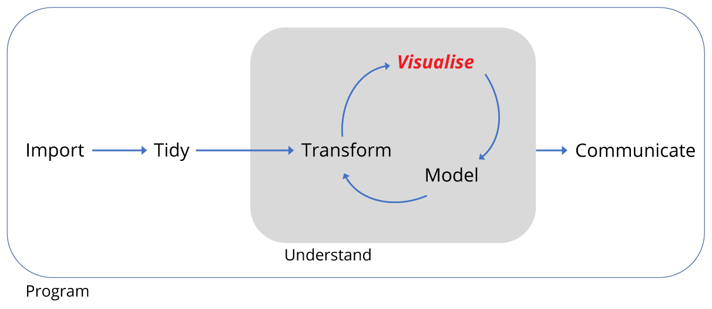

```{r, echo=FALSE, purl=FALSE,message=FALSE}
knitr::opts_chunk$set(results='hide', fig.path='img/r-lesson-')

# Load the tidyverse set of packages -------------------------------------------
library(tidyverse)
library(forcats)

surveys <- read_csv('data/portal_data_joined.csv')

# Create a vector for the experimental plots
exp_plots <- c(8,11,12,14,3,15,19,21)
# Create a character vector for rodents
rodents <- c("DM","DO","DS","PP","PF","PE","PM","RM")
# Create a character vector for Kangeroo Rats by subsetting the first
# three elements of rodents
krats <- rodents[1:3]

# Subset data
surveys_subset <- surveys %>% 
  # Filter observations from 1977 to 1990, for the 3 K-rats and 5 granivores, 
  # and for the 4 experimental plots
  filter(year <= 1990,                    
         species_id %in% rodents,         
         plot_id %in% exp_plots) %>%      
  # Make variable to indicate whether species is K-rat or Granivore
  mutate(rodent_type = if_else(species_id %in% krats, "Kangeroo Rat",
                               "Granivore"),
         # Make combined date variable
         date = lubridate::dmy(sprintf('%02d%02d%04d', 
                                       day, month, year)),
  # Add the quartley period
  quarter = lubridate::quarter(date,with_year = TRUE)) %>% 
  # Drop unwanted variables
  select(-sex,-hindfoot_length,-weight)

# Summarise data
# Summarise the data by rodent type, quarterly survey and plot type
by_quarter <- surveys_subset %>% 
  group_by(rodent_type,quarter,plot_type) %>% 
  summarise(captures = n()/3) 

# By month and by genus
by_month_genus <- surveys_subset %>% 
  group_by(genus,date,plot_type,rodent_type) %>% 
  summarise(captures = n()) 

by_month_mean <- by_month_genus %>% group_by(genus,plot_type,rodent_type) %>%
  summarise(mean_captures = mean(captures))
```

------------

> ### Learning Objectives
>
> By the end of this lesson the learner will:
>
> + Use geometrical objects and aesthetic mappings to produce time series plots, 
boxplots and bar charts
> + Understand how to use facets to create subplots of data
> + Understand how factors and statistical mappings can transform plots
> + Understand how to make positional and coordinate adjustments
> + Understand how to use themes and to customize plots

------------

<div style="text-align: center; margin-top: 30px; margin-bottom: 30px;">

</div>

## Motivation

We've transformed the surveys data ready for plotting, so let's remind ourselves
of the 

```{r, purl=FALSE,eval=FALSE}
ggplot(data = <DATA>) + 
  <GEOM_FUNCTION(mapping = aes(<MAPPINGS>))>
```


## Reproducing the time series

### Facets

```{r,purl=FALSE,echo=FALSE}

ggplot(data = by_quarter,aes(x=quarter,y=captures,colour=plot_type)) +
  geom_line() +
  geom_point() +
  facet_grid(~ rodent_type) +
  scale_x_continuous(breaks = seq(1977,1991,1))

```

### Positions

```{r,purl=FALSE,echo=T}
# Without jitter
ggplot(data = mpg) + geom_point(mapping = aes(x=displ, y=hwy, 
                                              colour=class))
# With jitter
ggplot(data = mpg) + geom_point(mapping = aes(x=displ, y=hwy, 
                                              colour=class),position = "jitter")

```

## Other plot types

### Boxplots

```{r,purl=FALSE,echo=TRUE}

ggplot(data= by_quarter,
       mapping = aes(x = rodent_type, y = captures, 
                     colour = rodent_type)) +
  geom_boxplot() +
  facet_wrap(~ plot_type)

```


### Position adjustments

```{r,purl=FALSE,echo=TRUE}
# Without jitter
ggplot(data = mpg) + geom_point(mapping = aes(x=displ, y=hwy, 
                                              colour=class))
# With jitter
ggplot(data = mpg) + geom_point(mapping = aes(x=displ, y=hwy, 
                                              colour=class),position = "jitter")

```

```{r,purl=FALSE,echo=TRUE}
ggplot(data= by_quarter,
       mapping = aes(x = rodent_type, y = captures, 
                     colour = rodent_type)) +
  geom_boxplot() +
  geom_point() +
  facet_wrap(~ plot_type)

ggplot(data= by_quarter,
       mapping = aes(x = rodent_type, y = captures, 
                     colour = rodent_type)) +
  geom_boxplot() +
  geom_point(position = "jitter") +
  facet_wrap(~ plot_type)

```

### Factors and statistical transformations

```{r,purl=FALSE,echo=FALSE}
# Orders the rodents alphabetically
ggplot(by_month_mean, aes(x = genus, 
                          y = mean_captures, 
                          fill=rodent_type)) +
  geom_bar(stat="identity") + 
  facet_grid(~ plot_type)
```

### Coordinate adjustments

```{r,purl=FALSE,echo=FALSE}
# Orders the rodents alphabetically and flips the coordinate system
ggplot(by_month_mean, aes(x = genus, 
                          y = mean_captures, 
                          fill=rodent_type)) +
  geom_bar(stat="identity") + 
  facet_grid(~ plot_type) +
  coord_flip()

```


```{r,purl=FALSE,echo=FALSE}

# Orders the rodents according to number of captures
ggplot(by_month_mean,
       aes(x = fct_reorder(genus,mean_captures),
           y = mean_captures, 
           fill=rodent_type)) +
  geom_bar(stat="identity") +
  facet_grid(~ plot_type) +
  coord_flip()

```

## Themes and customisations


```{r,purl=FALSE,echo=TRUE}

ggplot(data= by_quarter,
       mapping = aes(x = rodent_type, y = captures, 
                     colour = rodent_type)) +
  geom_boxplot() +
  geom_point(position = "jitter") +
  facet_wrap(~ plot_type) +
  xlab("Plot type") +
  ylab("Number of captures") +
  ggtitle("Monthly captures of rodents between 1977 and 1990") +
  theme_bw()

```

```{r,purl=FALSE,echo=FALSE}

ggplot(data = by_quarter,aes(x=quarter,y=captures,colour=plot_type)) +
  geom_line() +
  geom_point() +
  facet_grid(~ rodent_type) +
  scale_x_continuous(breaks = seq(1977,1991,1)) +
  xlab("Year") +
  ylab("Number of captures") +
  ggtitle("Monthly captures of rodents between 1977 and 1990") +
  theme_bw()

```

```{r, purl=FALSE,eval=FALSE}
ggplot(data = <DATA>) + 
  <GEOM_FUNCTION>(
     mapping = aes(<MAPPINGS>),
     stat = <STAT>, 
     position = <POSITION>
  ) +
  <COORDINATE_FUNCTION> +
  <FACET_FUNCTION>
```